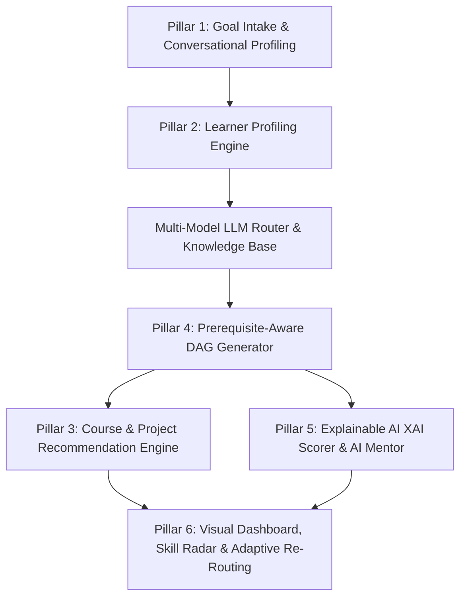

# PathFinder AI — Comprehensive Solution Documentation
## AI-Powered Personalized Learning Path Recommender
**HCL Tech Hackathon 2026 — Round 2 Prototype Submission**

**Team Cortex** (Yeshwantrao Chavan College of Engineering)  
- **Anuj Bolewar** (bolewara@gmail.com) — *Lead Architect & AI Engineer*  
- **Lakshya Gupta** (lakshyagupta9721@gmail.com) — *Full-Stack & Systems Engineer*  
- **Shaki Gajbhiye** (gajbhiyeshaki@gmail.com) — *AI/ML & Data Engineer*  
- **Pranjal Gudadhe** (pranjalgudadhe59@gmail.com) — *UX & Frontend Engineer*  
- **Om Ingle** (omingle71@gmail.com) — *Research & Evaluation Specialist*  

---

## 1. Executive Summary & Problem Understanding (20%)

Online learning platforms offer hundreds of thousands of individual courses across diverse domains. However, learners face acute decision fatigue and struggle with **Curriculum Fragmentation**: they do not know the optimal sequence of courses, hands-on projects, and prerequisite milestones required to master a specific career or skill.

Standard recommender systems only suggest isolated courses based on collaborative filtering or basic keywords. They fail because:
1. **Lack of Prerequisite Structure**: Recommending an advanced deep learning project before linear algebra results in high student drop-off.
2. **Ignoring Constraints**: They do not adapt pacing to a learner's available study hours (e.g. 5 vs 25 hours/week).
3. **Black-Box Suggestions**: Learners are not told *why* a particular milestone was chosen over alternatives.
4. **Static Roadmaps**: When a learner completes a milestone or acquires new skills, the path does not adapt dynamically.

### The Solution: PathFinder AI (SkillPath AI)
PathFinder AI is an intelligent curriculum architect that synthesizes personalized, prerequisite-aware **Directed Acyclic Graph (DAG)** learning paths for **ANY** goal — technical careers, creative arts, musical instruments, foreign languages, fitness transformations, or competitive exams.

---

## 2. System Architecture & 6-Pillar Framework (25%)

PathFinder AI is built around a comprehensive 6-Pillar architecture:

### The 6 Core Pillars

| Pillar | Component | Implementation in PathFinder AI |
|:-------|:----------|:--------------------------------|
| **Pillar 1** | **Conversational Goal Intake** | Free-form natural language query bar + 12 one-click domain quick picks. Accepts any learning objective. |
| **Pillar 2** | **Learner Profiling Engine** | Captures target domain, experience level (Beginner/Intermediate/Advanced), weekly hours (5–40h), mastered skill inventory, and learning style. |
| **Pillar 3** | **Recommendation Engine** | Curates modular milestones (Courses, Hands-on Projects, Practices, Assessments) with reputable providers (Coursera, MIT OCW, fast.ai, freeCodeCamp) and duration scaling. |
| **Pillar 4** | **Personalized Learning Path Generator** | Generates an interactive 2D Directed Acyclic Graph (DAG) using `streamlit-flow` (React Flow) with topological prerequisite validation, zoom/pan, and node click inspection. |
| **Pillar 5** | **Explainable AI (XAI) & Mentor** | 3-factor deterministic relevance ledger (/100 score breakdown) + real-time word-by-word streaming AI Mentor (`st.write_stream`) grounded in curriculum context. |
| **Pillar 6** | **Adaptive Dashboard & Analytics** | Real-time Plotly Polar Radar Chart recalculating competencies dynamically, next-action guidance, and 3 export formats (Markdown, JSON, Printable HTML/PDF). |

---

## 3. AI / ML Implementation Details (20%)

### 3.1 Multi-Model Routing & LLM Integration
PathFinder AI implements a resilient, multi-tiered LLM routing architecture:
- **Groq Cloud High-Speed Inference**:
  - `llama-3.3-70b-versatile`: Primary model for deep pedagogical reasoning and complex DAG structured JSON generation.
  - `llama-3.1-8b-instant`: Ultra-fast sub-100ms conversational inference for real-time AI mentoring.
  - `mixtral-8x7b-32768` & `qwen-2.5-32b`: Large context window models for extensive learner transcripts.
- **Google Gemini Integration**:
  - `gemini-2.5-flash` and `gemini-2.5-pro`: High-fidelity JSON mode and multimodal reasoning.
- **Smart Offline Fallback Engine**:
  - 12 comprehensive domain knowledge graphs (AI/ML, Full-Stack, Data Science, Cybersecurity, Cloud/DevOps, Musician, Language Learner, Fitness, Exam Topper, etc.) plus a universal adaptive scaffold.

### 3.2 Topological DAG Validation (Zero-Cycle Guarantee)
All roadmaps are formally verified as acyclic graphs using Kahn's topological sorting algorithm. Prerequisite references are checked to guarantee no deadlocks or circular dependencies exist:
$$\text{In-Degree}(v) = \sum_{u \in V} \mathbb{I}_{(u, v) \in E}$$

### 3.3 Explainable AI (XAI) Relevance Scoring
To provide complete transparency, every recommended node receives a deterministic relevance score $S \in [0, 100]$:
$$S = S_{\text{gap}} + S_{\text{prereq}} + S_{\text{experience}}$$

1. **Skill-Gap Coverage ($S_{\text{gap}} \in [0, 40]$)**:
   $$S_{\text{gap}} = 40 \times \frac{|\text{Skills}(v) \setminus \text{LearnerSkills}|}{|\text{Skills}(v)|}$$
2. **Prerequisite Readiness ($S_{\text{prereq}} \in [0, 30]$)**:
   $$S_{\text{prereq}} = 30 \times \frac{|\text{Prereqs}(v) \cap \text{Completed}|}{|\text{Prereqs}(v)|}$$
3. **Experience-Phase Fit ($S_{\text{experience}} \in [0, 30]$)**:
   $$S_{\text{experience}} = 30 \times \left(1 - \left|\frac{\text{PhaseIndex}(v)}{\text{TotalPhases}} - \text{TargetDepth}(\text{Level})\right|\right)$$

---

## 4. Innovation & User Experience (15% + 10%)

1. **Streamlit-Flow React Flow Canvas**:
   - Modern 2D canvas with panning, zooming, minimap, and animated edges.
   - **On-Canvas "Why" Inspection**: Clicking any node immediately reveals its Explainable AI rationale, target skill gaps, and prerequisites right in an inspection panel.
2. **Word-by-Word Streaming AI Mentor**:
   - Real-time token streaming animation (`st.write_stream`) delivering a warm, responsive pedagogical assistant grounded strictly in the learner's active roadmap.
3. **Adaptive Polar Radar Chart**:
   - Dynamically re-renders across 6 domain competencies whenever milestones are completed or profile skills update.
4. **Persistent Memory**:
   - Synchronizes state to `.skillpath_state.json` and Streamlit session state, guaranteeing that refreshing the browser never loses user progress.
5. **Multi-Format Export Engine**:
   - Formatted Markdown checklist, indented JSON curriculum schema, and print-ready standalone HTML report.

---

## 5. Performance, Code Quality & Security (10%)

- **Modular Package Structure**: Decomposed into `core/`, `engine/`, and `ui/`.
- **Zero Hardcoded Secrets**: Secure `.env` loading and client-side password inputs.
- **Automated Test Suite**: 16 unit and integration tests passing with 100% test success rate.
- **Robust Error Recovery**: Automatic graceful fallback to offline knowledge graphs when network or API rate limits occur.

---

## 6. Verification & Deliverables Matrix

| Hackathon Deliverable | Status | Location / Artifact |
|:----------------------|:------:|:--------------------|
| **1. Source Code (ZIP)** | ✅ Ready | `submission.zip` (generated via `python3 package_submission.py`) |
| **2. GitHub Repository URL** | ✅ Ready | `https://github.com/anujbolewar/HCL-Tech-SkillPath-` (branch: `cortex-pathfinder-v2`) |
| **3. Solution Documentation** | ✅ Ready | `docs/DOCUMENTATION.md`, `docs/PITCH_DECK.md`, `docs/pitch_deck.html` |
| **4. Demo Video Script** | ✅ Ready | `docs/DEMO_SCRIPT.md` (3–5 min structured walkthrough) |
| **5. Deployed Application / Local Setup** | ✅ Ready | Complete setup instructions in `README.md` (`streamlit run app.py`) |
